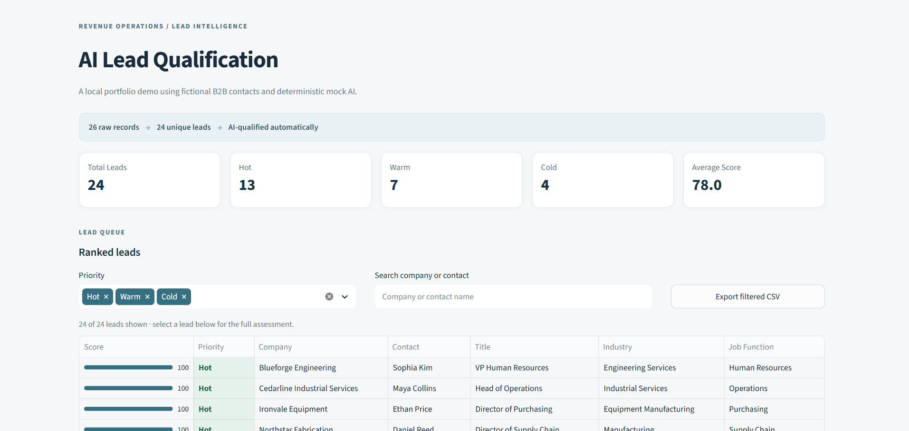
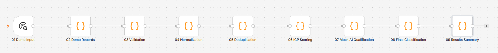
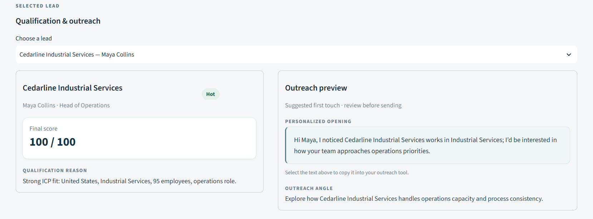
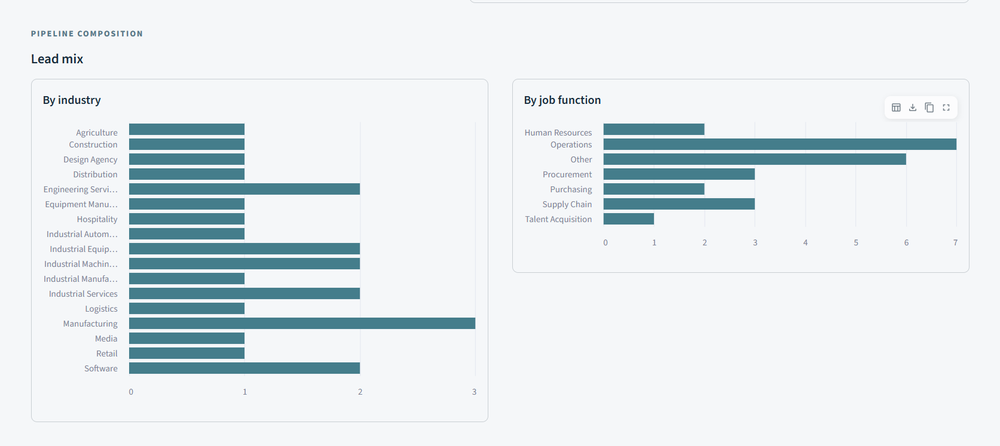

# AI Lead Qualification & Enrichment Workflow

A local, fictional B2B sales-operations portfolio demo. It turns a raw CSV into deduplicated, scored leads with an ICP assessment, a short qualification reason, an outreach angle, and a personalized opening. A Streamlit dashboard makes the results easy to review and export. The default mock AI mode needs no account or API key.

## Demo

### Dashboard Overview



### Automation Workflow



### Lead Qualification & Personalized Outreach



<details>
<summary>View analytics breakdown</summary>



</details>

## Business problem and design

Sales teams often receive inconsistent lead lists and spend time reviewing poor-fit or duplicate contacts. This demo applies visible, repeatable ICP rules, then uses a replaceable AI provider for concise text. It does **not** claim verified enrichment from external databases: all output is derived from the input record and target ICP.

`CSV → validate/normalize → deduplicate → six-part ICP score → mock or live AI JSON → bounded score adjustment → output CSV → Streamlit dashboard`

Python 3.10+ handles processing with the standard library; Streamlit powers the dashboard. Optional local n8n Community Edition provides a visual manual trigger for the same tested processor. A small loopback-only Python service lets n8n use its built-in HTTP Request node without shell-command access.

## Quick start on Windows PowerShell

Open PowerShell in the cloned repository folder, then run:

```powershell
python -m venv .venv
.\.venv\Scripts\Activate.ps1
python -m pip install -r requirements.txt
python -m scripts.process_leads
python -m unittest discover -s tests -v
python -m streamlit run dashboard/app.py
```

If PowerShell blocks activation, use `.\.venv\Scripts\python.exe` in place of `python` for the remaining commands. The dashboard opens at `http://localhost:8501`. The checked-in `data/qualified_leads.csv` is generated from the fictional sample in mock mode, so the dashboard can open immediately after dependencies are installed.

To process a different lead file, use `python -m scripts.process_leads --input "path\to\leads.csv" --output "data\qualified_leads.csv"`. Input headers should match `data/sample_leads.csv`; `company_name`, `first_name`, and `last_name` headers are mandatory, while blank values are retained and flagged. Duplicate contacts are identified by normalized website plus name, or email if an optional email column exists. The first occurrence wins.

## Start n8n locally

Install Node.js and npm if needed. Start the local processing bridge in one PowerShell window from the project folder:

```powershell
.\.venv\Scripts\python.exe -m scripts.local_api
```

In a second PowerShell window from the same folder, start n8n:

```powershell
npx n8n
```

Open `http://localhost:5678`, complete local owner setup if prompted, and import `n8n/lead_qualification_workflow.json` using **Import from File**. Click **Execute workflow**. Its fixed HTTP request to `http://127.0.0.1:8765/run` runs the mock processor, reports counts, and writes `data/qualified_leads.csv`. See [n8n import instructions](n8n/IMPORT_INSTRUCTIONS.md) for details and troubleshooting.

The bridge binds only to `127.0.0.1`, accepts one fixed action, and exposes no file-path or shell parameters. The n8n export contains no credentials.

## Optional Live LLM integration

Mock mode is the default. For an OpenAI-compatible chat-completions service, set `AI_MODE=live`, `LLM_API_URL`, `LLM_API_KEY`, and `LLM_MODEL` as environment variables, then run `python -m scripts.process_leads --mode live`. Copy `.env.example` for reference; Python intentionally does not load `.env` automatically. Never commit a populated `.env`. The live provider validates four JSON fields and falls back to deterministic mock text on malformed responses or API errors, marking `ai_source=mock_fallback`. The deterministic score can move only +5, 0, or −5 based on the validated assessment; it always stays in 0–100. The local n8n bridge intentionally stays in mock mode for a repeatable demo.

## Project map

- `scripts/scoring.py`: normalization, function labels, component weights, priority thresholds.
- `scripts/ai_provider.py`: deterministic mock and optional live JSON provider.
- `scripts/process_leads.py`: file processing, deduplication, output schema.
- `dashboard/app.py`: KPIs, filters, ranked table, distributions, export.
- `n8n/`: importable local orchestration workflow and instructions.
- `docs/`: architecture, test plan, portfolio copy, and video script.

Run `python -m unittest discover -s tests -v` whenever processing rules change.
