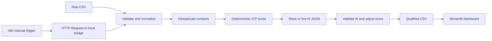

# Architecture

The CSV processor is the source of truth. n8n invokes it; the dashboard reads its CSV. This keeps results identical whether the processor runs from PowerShell or the n8n canvas.

The baseline uses six capped components: geography 20, industry 25, company size 15, seniority 15, job function 15, and completeness 10. The output includes a JSON `score_breakdown`, baseline score, AI assessment and source, final score, and priority. Priority thresholds are Hot 80–100, Warm 55–79, Cold 0–54.

Normalization trims whitespace, standardizes US aliases, strips URL schemes and trailing slashes, and parses positive employee counts. Blank values remain blank and are listed in `missing_fields`; they lower the relevant score components. Duplicates use optional email where available, otherwise normalized website and contact name. The first row is retained. There is no external company lookup or claim of verified enrichment.

The mock provider evaluates the lead's known ICP signals and writes deterministic, grounded text. The live provider accepts an OpenAI-compatible chat-completions response with four required JSON strings. Invalid or failed live responses fall back to mock text. Only the assessment may change the score, by +5/0/−5, then the result is clamped to 0–100. The provider interface in `scripts/ai_provider.py` can be replaced without changing CSV or dashboard code.

The workflow JSON stores no credentials. Its built-in HTTP Request node calls a loopback-only Python service, which invokes the same processor used by the CLI. No n8n shell-command node is enabled. The Streamlit app reads the generated CSV and offers filtering, sorting, distributions, a preview, and filtered CSV download.
